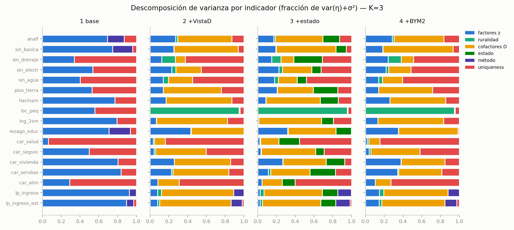

# La maquinaria de medición: por qué dos burocracias cuentan historias distintas del mismo territorio

**Borrador de trabajo (Paper 1, metodológico) — 2026-07-13**
*Objetivo editorial: Social Indicators Research (español; traducción al enviar).
Encuadre: contribución aplicada-metodológica — no una teoría general de GLLVM; eso exigiría un estudio de simulación (extensión declarada).*

## Resumen

México publica dos mediciones oficiales de la privación municipal — el índice de marginación
(CONAPO, agregación DP2 sobre el censo) y la pobreza multidimensional (CONEVAL, estimación en
áreas pequeñas calibrada a totales estatales) — que con frecuencia cuentan historias distintas
del mismo territorio. En lugar de proponer un índice adicional, modelamos la *maquinaria de
medición*: formalizamos el proceso generador de ambas mediciones como un DAG de medición a
nivel de variable (56 nodos, 97 aristas tipificadas, aciclicidad verificada
computacionalmente) y estimamos un modelo de variables latentes (GLLVM) marginalizado que
trata los 17 indicadores elementales de ambas agencias como vistas ruidosas de un espacio
común de privación, con efectos de método explícitos y efectos estatales. Tres contribuciones.
Primera, técnica: el principal problema de identificación y convergencia de esta aplicación —
la multimodalidad entre factores, bloques de método y unicidades — se resuelve con una
secuencia diagnóstica de tres pasos — verosimilitud integrada, efectos de método sobre
direcciones de dependencia metodológica predefinidas, y monitoreo del subespacio ΛΛᵀ, la
cantidad identificada (R̂ = 1.003; tres eigenvalores sustantivos compatibles con rango
efectivo 3). Segunda, el resultado fundacional: el componente de método dominante en la
discordancia entre agencias es consistente con la firma del modelo de imputación de ingreso
(SAE-EBPH; carga 0.58) y parte limpiamente los regímenes espaciales de discordancia, mientras
que en educación las agencias esencialmente acuerdan (0.012) y el desacuerdo de vivienda es un
fenómeno estatal (0.135 → 0.029 al condicionar en efectos de estado). Tercera, epistemológica:
la incertidumbre posterior municipal es parte del resultado — la clasificación individual es
sustantiva en 42/55/14% de los municipios según el eje, y esa incertidumbre tiene geografía
propia: la representación es más precisa en municipios rurales y pequeños que en los urbanos y
grandes.

**Palabras clave:** pobreza multidimensional; marginación; variables latentes; error de
medición; pequeñas áreas; México.

---

## 1. Introducción: dos mediciones, una pregunta de estructura

Dos municipios mexicanos pueden mostrar la misma marginación agregada y ocupar posiciones
opuestas en la estructura de la desigualdad: uno carece de infraestructura, otro de ingresos,
otro queda fuera de la actividad económica que ilumina su territorio. Las dos mediciones
oficiales que deberían distinguir estos casos — el índice de marginación de CONAPO y la
pobreza multidimensional municipal de CONEVAL — difieren por construcción: constructos
distintos (territorio vs. personas), instrumentos distintos (censo completo vs. muestra censal
y encuesta), y maquinarias estadísticas distintas (agregación DP2, en la tradición de Peña
Trapero — véanse Peña-Trapero 2021 y Zarzosa Espina 2021 — vs. modelos de áreas pequeñas
calibrados a totales estatales; Rao & Molina 2015). La pregunta que organiza este trabajo no
es cuál medición es mejor, sino qué estructura — dimensional, de método, estatal — explica
cuándo y por qué cuentan historias distintas.

La respuesta corta de este paper: una parte sustancial de la discordancia no es del territorio
sino de la maquinaria, y es consistente principalmente con la firma del método de imputación
de ingreso. Llegar a esa respuesta con garantías exige dos piezas que constituyen la
contribución metodológica: un DAG de medición que hace explícitas las dependencias mecánicas
que un análisis conjunto no debe confundir con estructura sustantiva (§3), y una estrategia de
estimación e identificación que resuelve el principal problema de identificación y
convergencia de esta aplicación en lugar de ocultarlo (§4). El paper compañero explota el
espacio latente resultante para la lectura sustantiva de la desigualdad territorial.

El resto del artículo procede así: §2 sitúa la contribución en la literatura; §3 presenta los
datos y el DAG de medición (Figura 1); §4 desarrolla el método — especificación, priors,
estimación y la secuencia de identificación (Tabla 1, Figura 2); §5 presenta el resultado
fundacional (Tabla 2, Figura 3); §6 la certeza municipal y su geografía (Figuras 4 y 5); §7 la
descomposición de los efectos estatales (Tabla 3); §8 discute. El apéndice técnico documenta
la escalera completa con scores muestreados, el test de alineación Procrustes y la comparación
formal con y sin efectos estatales.

## 2. Antecedentes y trabajo relacionado

La medición oficial de la pobreza multidimensional mexicana pertenece a la familia de conteo
de Alkire & Foster (2011): carencias dicotomizadas por persona, agregadas con una regla de
identificación. El índice de marginación de CONAPO viene de otra tradición — la distancia DP2
de Peña Trapero, diseñada para agregar indicadores territoriales continuos sin ponderaciones
arbitrarias (Peña-Trapero 2021; Zarzosa Espina 2021, para su uso regional en España, el molde
del uso mexicano). Ambas tradiciones producen *índices*; la literatura comparada suele
preguntarse cuál ordena mejor. Nuestra pregunta es anterior: qué proceso generador conjunto
explica que dos agregaciones defendibles del mismo territorio diverjan donde divergen. Para
los cuatro indicadores municipales que CONEVAL no observa sino estima, la maquinaria relevante
es la estimación en áreas pequeñas — el emparejamiento censo-encuesta con predicción empírica
mejor y calibración a totales estatales que sintetizan Rao & Molina (2015) — y esa maquinaria,
mostramos, deja una firma identificable en la covarianza inter-agencia.

El instrumento natural para modelar vistas múltiples y ruidosas de un constructo común es el
modelo de variables latentes generalizado (GLLVM; Skrondal & Rabe-Hesketh 2004), cuya
aplicación moderna a matrices multivariadas de gran escala está estandarizada en ecología
(Niku et al. 2019) pero sigue siendo rara en medición de pobreza. La dificultad práctica que
esta literatura reporta — multimodalidad posterior, sensibilidad a anclas, label switching —
suele tratarse como estorbo computacional; aquí la tratamos como información: distinguir qué
parte es rotación inocua y qué parte es no-identificación real es precisamente lo que permite
separar factores, método y federalismo. La raíz conceptual de nuestro efecto de método es la
matriz multirrasgo-multimétodo de Campbell & Fiske (1959): dos instrumentos que miden los
mismos rasgos comparten varianza de método además de varianza de rasgo. Nuestro aporte a esa
tradición es de parametrización — direcciones de dependencia metodológica *predefinidas* y de
dirección fija, ortogonales al nivel, que resuelven la colinealidad método-factor que las
direcciones uniformes inducen — y de objeto: hasta donde sabemos, nadie ha modelado la
maquinaria conjunta de dos agencias estadísticas del mismo país como problema latente con
método explícito y proceso generador documentado como grafo.

En la literatura mexicana, la crítica canónica al índice de marginación es la de Cortés &
Vargas (2011): el índice de CONAPO confunde constructo con método y no es comparable en el
tiempo sin reconstrucción. Este paper puede leerse como la respuesta formal a esa crítica en
el corte transversal — separar constructo (z), método (m) y heterogeneidad federal (γ) es
exactamente la descomposición que aquella objeción pedía. El debate Boltvinik–CONEVAL sobre
umbrales y agregación de la pobreza multidimensional, y la tradición de series comparables
bajo cambio de instrumento (Székely y coautores), son el trasfondo sustantivo: dos mediciones
oficiales del mismo fenómeno con maquinarias en disputa. Las metodologías oficiales que aquí
se modelan están documentadas por las propias agencias (CONEVAL 2021 para la medición
municipal de pobreza; CONAPO 2021 para el índice de marginación 2020), y el DAG de §3 es, en
buena medida, su lectura formalizada.

## 3. Datos y el proceso generador como DAG de medición

### 3.1 Indicadores

Trabajamos con los 17 indicadores elementales que alimentan ambas mediciones para 2,469
municipios en 2020; la matriz del modelo tiene 2,455 tras exigir covariables completas. Los
14 excluidos son en su mayoría municipios de creación reciente (los seis nuevos de Chiapas,
tres de Morelos, San Quintín, Seybaplaya, Bacalar, Puerto Morelos) que las series fuente de
covariables — en particular la de remesas — aún no incorporan; van de 4,315 a 117,568
habitantes en siete estados, de modo que el descarte no selecciona por tamaño ni por nivel de
privación. Los indicadores: 9 de CONAPO desde el censo (analfabetismo, sin educación básica,
sin drenaje, sin electricidad, sin agua entubada, piso de tierra, hacinamiento, población en
localidades pequeñas, ingresos hasta 2 salarios mínimos) y 8 de CONEVAL (rezago educativo y
las carencias de salud, seguridad social, vivienda, servicios básicos y alimentación — en la
metodología de conteo de Alkire & Foster 2011 — más las dos líneas de pobreza por ingreso).
Deliberadamente no usamos los índices finales, que son funciones deterministas de estos
componentes. Los cuatro indicadores que CONEVAL modela vía áreas pequeñas (las dos líneas de
ingreso, y las carencias estimadas con el emparejamiento censo-ENIGH; Rao & Molina 2015) no
son conteos: una verosimilitud binomial les atribuiría precisión falsa, por lo que toda la
matriz se modela en escala logit estandarizada (§4.1).

### 3.2 El DAG de medición

El DAG — cuyo objeto canónico son dos tablas versionadas de 56 nodos y 97 aristas en siete
semánticas tipificadas, con validación automática de aciclicidad y de una matriz de tipos
permitidos — explicita, entre otras relaciones:

- que la pobreza multidimensional **no es derivable de las prevalencias marginales
  municipales** — pasa por la distribución conjunta persona-hogar y una regla de
  identificación;
- que la estimación SAE y la calibración estatal son **operadores secuenciales**
  (SAE → preliminares → calibración → publicados), cada uno con su huella;
- que la población en localidades pequeñas es un solo nodo con **rol dual** — condición
  estructural de dispersión *y* componente del índice de marginación, lo que induce una
  endogeneidad estructural interna del propio índice;
- que el lazo de política FAIS es acíclico solo al **versionarse temporalmente** (pobreza
  medida en t−1 → asignación → inversión → privación en t): la fórmula asigna recursos usando
  la propia medición de pobreza, y esa circularidad es una propiedad del sistema de medición,
  no un artefacto del análisis;
- y que los cofactores contextuales entran con **dos rutas** cada uno — hacia la privación
  latente y directamente hacia indicadores específicos por canales que no son privación
  (costo de red por dispersión, composición de cohortes, estructura ocupacional,
  transferencias) — de las cuales la especificación identifica la suma, límite que se declara.

De este grafo se derivan cinco dependencias mecánicas entre indicadores que el modelo debe
absorber en bloques de método y no en factores: las dos líneas de ingreso comparten el modelo
SAE; los cuatro indicadores SAE comparten la calibración estatal; los indicadores censales de
CONAPO comparten instrumento; las carencias de vivienda y servicios comparten definiciones
fronterizas; y educación aparece en ambas agencias con cohortes distintas. La Figura 1
presenta la vista conceptual del grafo; la versión completa a nivel de variable, con las 97
aristas auditables, está en el material suplementario.

## 4. Método

### 4.1 Transformación de escala

Cada indicador municipal se observa como porcentaje y_j ∈ [0, 100]. Se transforma con
corrección de continuidad c = 0.5, p_j = (y_j + c) / (100 + 2c), luego logit(p_j) y
estandarización por indicador ("escala logit-z"). La corrección evita ±∞ en los ceros
estructurales (p. ej., municipios sin viviendas con piso de tierra) sin recortar información;
la estandarización hace comparables las cargas entre indicadores de dispersión muy distinta.

### 4.2 Especificación y priors

El marco es un GLLVM (Skrondal & Rabe-Hesketh 2004; en su implementación aplicada moderna,
Niku et al. 2019) con verosimilitud gaussiana en escala logit-z y scores marginalizados. La
media condicional del indicador j en el municipio i es

  η_ij = α_j + λ_j′z_i + β_r,j·rural_i + β_D,j′x_i + γ_j,s(i) + m_ij + ε_ij,

con z_i ∈ ℝ³ los factores latentes, x_i las covariables de composición (demografía, mezcla
sectorial, remesas), γ_j,s efectos estado×indicador y m_ij efectos de método por familia.
Marginalizando z y m, la verosimilitud integrada es

  Y_i ~ MvN(μ_i, Σ),  Σ = ΛΛᵀ + Σ_b λ_b² v_b v_bᵀ + Ψ,

donde Λ (17×3) apila las cargas, v_b son las tres direcciones de dependencia metodológica
*fijas* (§4.4) con magnitud λ_b libre, y Ψ = diag(σ_j²) las unicidades. Priors: λ_jk ~ N(0, 1)
sin restricciones (especificación libre); coeficientes de media W ~ N(0, 1); efectos estatales
γ_j,· ~ ZeroSumNormal(σ = 0.5) por indicador (la restricción de suma cero separa nivel
nacional de desviación estatal); magnitudes de método λ_b ~ HalfNormal(0.5); unicidades
σ_j ~ HalfNormal(1). La extensión espacial BYM2 (Besag, York & Mollié 1991, en la
reparametrización de Riebler et al. 2016) se evaluó como especificación adicional de la
escalera; su patología de frontera (ρ → 1) se documenta en el apéndice A.

### 4.3 Estimación y diagnósticos

NUTS con 4 cadenas, 1,000 de calentamiento + 1,000 draws por cadena, target_accept 0.9,
semilla fija. La cantidad monitoreada es ΛΛᵀ — el subespacio, invariante a rotación — no Λ.
Distinguimos tres veredictos de convergencia: **estructural** (R̂ y ESS sobre ΛΛᵀ y funciones
invariantes), **no-rotacional** (parámetros de media y varianza: W, γ, σ, λ_b) e
**interpretativo** (estabilidad de los ejes nombrados tras la convención de orientación).
Un modelo puede pasar el segundo y fallar el primero; reportar solo R̂ de parámetros de media
oculta exactamente la patología que importa.

### 4.4 La secuencia de identificación

Denotamos la escalera con scores muestreados como especificaciones S1–S4: S1 (GLLVM base), S2
(+covariables de composición), S3 (+efectos estatales), S4 (+BYM2 espacial); y los modelos de
verosimilitud integrada como M−γ (marginalizado sin efectos estatales) y M+γ (con ellos). La
estimación con scores muestreados exhibe la patología conocida: cadenas en rotaciones
distintas pese a anclas y — demostrado con un test de alineación Procrustes por draw
(apéndice B) — no-convergencia genuina más allá de la rotación (R̂ alineado 2.16), con las
cadenas difiriendo en el reparto de varianza entre factores, bloques de método y unicidades.
La solución tiene tres pasos, cada uno con su diagnóstico (Tabla 1):

1. **Marginalizar.** La verosimilitud integrada elimina ~7,400 parámetros latentes; la
   estructura de medias converge de inmediato (R̂ ≤ 1.011) pero la descomposición de
   covarianza no (R̂ ΛΛᵀ = 2.05): la multimodalidad no provenía únicamente de los scores
   municipales.
2. **Direcciones de dependencia metodológica predefinidas.** Los bloques de método con
   dirección uniforme sobre su soporte son casi colineales con las cargas del factor; fijar
   cada dirección desde el DAG — con solo la magnitud libre — reduce la multimodalidad
   (R̂ 1.53 — medido *aún con las anclas puestas*, el paso intermedio de esta secuencia en la
   especificación con γ_s; la coincidencia con el R̂ = 1.530 del modelo sin efectos estatales
   de la Tabla 1 es un accidente numérico entre dos corridas distintas) y es conceptualmente
   superior — la lógica de la matriz multirrasgo-multimétodo de Campbell & Fiske (1959)
   llevada a parametrización. Dos de las tres direcciones son contrastes inter-agencia
   (CONAPO+/CONEVAL−, ortogonales al nivel): educación {analf +½, sin_basica +½, rezago_educ
   −1} y vivienda-servicios {drenaje, electricidad, agua +⅓ cada uno; car_vivienda,
   car_servbas −½ cada uno}. La tercera es un **bloque intra-agencia**: las dos líneas de
   ingreso {+1, +1}, que captura su co-movimiento más allá del factor monetario — la firma del
   modelo SAE compartido, no un desacuerdo entre agencias. Cada v_b se normaliza a norma 1.
3. **Liberar las anclas.** El modo restante era un conflicto anclas-verosimilitud (una cadena
   alcanzaba logp +106 pagando un prior extremo por colapsar el ancla monetaria). Sin anclas,
   monitoreando solo ΛΛᵀ: **R̂ = 1.003** con ESS 3,490, cero divergencias, BFMI 0.91, y tres
   eigenvalores sustantivos de E[ΛΛᵀ] (1.23, 0.50, 0.34) con el resto cercanos a cero —
   compatibles con rango efectivo 3, condicionado a la especificación y escala; no es una
   prueba de K.

**Tabla 1. La escalera de convergencia.** Nomenclatura: S1–S4 = escalera con scores
muestreados; M−γ / M+γ = verosimilitud integrada sin/con efectos estatales — dos ejes
distintos (muestreado/marginalizado × sin/con γ_s), no una sola escalera. Los ELPD solo se
comparan dentro del mismo bloque de verosimilitud: la escalera muestreada usa verosimilitud
condicional puntual; los marginalizados, MvN integrada — el objeto predictivo
cambia.<!-- src: tabla1_escalera.csv -->

| Modelo | Moran I resid. | R̂ | ELPD-LOO | ¿Converge? |
|---|---|---|---|---|
| S1 (base, z muestreada) | 0.413 | 2.19 | −25,833.6 | no (multimodal) |
| S2 (+ covariables de composición) | 0.345 | 2.70 | −15,624.4 | no (multimodal) |
| S3 (+ efectos estatales) | 0.223 | 1.90 | −13,554.7 | no (multimodal) |
| S4 (+ BYM2 espacial) | 0.323 | 2.50 | −16,855.0 | no (multimodal) |
| M−γ (marginalizado sin γ_s) | — | 1.530 | −29,516.1 | no (multimodal) |
| **M+γ (marginalizado con γ_s, canónico)** | — | **1.003** | **−24,106.1** | **sí** |

Los ejes canónicos se definen por eigen-descomposición de E[ΛΛᵀ] con convención de signo
documentada (elemento mayor positivo; ejes por draw alineados al canónico): eje 1
material-infraestructural, eje 2 educativo, y eje 3 — la dimensión que las anclas suprimían —
el contraste de *vivienda e ingreso contra servicios de red*. Los scores municipales E[z|Y] se
obtienen por regresión GLS por draw — ẑ_i = E[Λᵀ Σ⁻¹ (Y_i − μ_i)] sobre el posterior — con
media y desviación posterior por municipio y eje (Figura 2 muestra la descomposición de
varianza resultante por indicador).

### 4.5 Qué hacen los efectos estatales

Los efectos estatales no son decorativos, y el orden del argumento importa. (i) Sin γ_s el
modelo no identifica una posterior estable: el marginalizado sin efectos estatales sigue
estructuralmente multimodal — la multimodalidad no era solo label switching. (ii) En esa
especificación aparece una cuarta dirección latente débil y un eje rota 53° respecto de la
solución canónica (apéndice C). (iii) Al incluir γ_s, la reducción de unicidad por indicador
es proporcional a su share de varianza estatal — evidencia directa de que, sin γ_s, la
heterogeneidad estatal se reparte ambiguamente entre unicidad y covarianza latente. (iv) La
comparación de verosimilitud idéntica favorece al modelo con efectos estatales (ELPD
+5,410 ± 135), pero este contraste es descriptivo y se interpreta con cautela: uno de los dos
modelos comparados no está bien identificado.

## 5. Resultado fundacional: la discordancia es de método

El modelo estima el componente de método por familia sobre su dirección predefinida, con
magnitud libre, y produce scores municipales E[m|Y] con incertidumbre — la proyección GLS del
residuo sobre la dirección correspondiente, escalada por su carga posterior, análoga a E[z|Y].
La Tabla 2 resume; la Figura 3 mapea.

**Tabla 2. El componente de método por familia.** M−γ/M+γ = marginalizado sin/con efectos
estatales (Tabla 1); cargas = desviación estándar del componente de método. "% sustantivo" =
municipios con |m|/sd ≥ 2. Medias por régimen espacial de la discordancia observada (AA =
"más marginado que pobre").<!-- src: desacuerdo_familias.csv -->

| Familia | Carga M−γ | Carga M+γ | % sustantivo | media AA | media BB |
|---|---|---|---|---|---|
| educación (contraste inter-agencia) | 0.012 | 0.012 | 0.0 | 0.000 | 0.000 |
| líneas de ingreso (bloque SAE-EBPH) | **0.582** | **0.574** | **22.6** | **−0.325** | **+0.339** |
| vivienda-servicios (contraste inter-agencia) | 0.135 | 0.029 | 0.0 | 0.021 | 0.012 |

Tres hechos:

1. **En educación las agencias esencialmente acuerdan** (carga 0.012) — el desacuerdo aparente
   entre indicadores educativos vive en cargas y cohortes, no en método.
2. **El desacuerdo de vivienda-servicios es un fenómeno estatal** (carga 0.135 sin efectos
   estatales, 0.029 con ellos): huella de la calibración, no del territorio municipal.
3. **El componente de método dominante es la firma del modelo de ingreso SAE-EBPH** (0.58) —
   las dos líneas de pobreza moviéndose juntas más allá del factor monetario. Esa firma
   municipal parte los regímenes espaciales de discordancia: media de −0.325 en los municipios
   "más marginados que pobres" y +0.339 en los "más pobres que marginados", con 22.6% de
   municipios con firma sustantiva y sin correlación con composición (|r| ≤ 0.001 con
   dispersión rural, envejecimiento y tamaño poblacional<!-- src: desacuerdo_familias.csv
   corr_* -->).

La discordancia "más pobre que marginado" que originó el proyecto es, en buena parte,
consistente principalmente con la firma compartida del método de imputación de ingreso: el
componente de método asociado a las líneas SAE domina la discordancia estimada. La firma es
inferida — se identifica desde la covarianza residual y la estructura del DAG, no comparando
estimaciones con y sin SAE (§8) —, pero el resultado es fundacional y no una validación:
reordena qué preguntas territoriales son formulables con estas mediciones — las comparaciones
de ingreso entre municipios dentro de un estado arrastran la firma del modelo SAE, mientras
que las comparaciones educativas son limpias de método.

La lectura complementaria por indicador acota — como falsación posible, no como prueba — la
interpretación de los efectos estatales: los indicadores SAE-calibrados no dominan el
componente estatal (Δshare vs. directos de CONEVAL: −0.034, IC95 [−0.060, −0.007]) aunque
exhiben un piso de calibración respecto de los censales (+0.027,
[+0.007, +0.049]).<!-- src: tabla_medicion_federalismo.csv -->

## 6. Identificación del subespacio e incertidumbre municipal

La identificación es del subespacio, no de los ejes: reportamos por eso la certeza de
clasificación municipal como resultado. La clasificación individual es sustantiva (|z|/sd ≥ 2)
en 41.9% de los municipios para el eje material, 54.6% para el educativo y solo 13.6% para el
contraste de vivienda-ingreso contra servicios de red<!-- src: certeza_canonica.csv --> — ese
tercer eje existe como dirección de covarianza nacional, pero su clasificación municipal
individual es débil en la mayor parte del territorio, y todo uso aplicado debe heredar esa
distinción (Figuras 4 y 5).

![Figura 4. Certeza posterior por eje canónico: |E[z]|/SD[z] clasificado en indistinguible de cero (<1), sugerente (1–2) y sustantivo (≥2). Sustantivo: 41.9% (eje material), 54.6% (educativo), 13.6% (vivienda-ingreso vs redes).](../figures/04_diagnostico_mapas/fig_certeza_canonica.png)

![Figura 5. Los tres ejes canónicos del espacio latente condicional: media posterior E[z|Y] (arriba) y desviación posterior (abajo) por municipio, modelo marginalizado convergido (R̂ ΛΛᵀ = 1.003).](../figures/04_diagnostico_mapas/fig_mapas_canonicos.png)

La incertidumbre tiene además geografía propia: la desviación posterior municipal crece con el
tamaño y la urbanización (correlación +0.322 con log población en el eje material; −0.259 con
ruralidad<!-- src: veta_ignorancia.csv -->). Condicionado en las covariables, la
representación municipal es más precisa en municipios rurales y pequeños que en los urbanos y
grandes — un patrón opuesto al de los diseños muestrales, que saben más donde hay más gente.
Una explicación plausible, no identificada, es la heterogeneidad urbana intra-municipal: la
desviación respecto de la composición es más idiosincrática precisamente donde el municipio
agrega realidades internas más diversas.

## 7. Qué hacen los efectos estatales: federalismo sectorial y legibilidad institucional

El componente estatal estimado no es un gradiente único. La descomposición espectral de la
matriz γ (17 indicadores × 32 estados) muestra que solo 42% de su varianza es un factor
común — interpretable como capacidad estatal: correlaciona +0.42 con el log del PIB estatal
per cápita — y el 58% restante es específico por dominio de política: **federalismo
sectorial**, no un ranking de estados (valores exactos en la Tabla 3; en prosa redondeamos).

**Tabla 3. Descomposición espectral de los efectos estatales** (SVD de la matriz γ 17×32
centrada por indicador).<!-- src: tabla3_gamma.csv, veta_gamma_pca.csv -->

| Medida | Valor |
|---|---|
| Share de varianza del PC1 (gradiente común) | 41.8% |
| Share de varianza del PC2 | 14.9% |
| Share específico por dominio (sectorial) | 58.2% |
| corr(PC1 estatal, log PIBE per cápita) | +0.42 |
| corr(PC1 estatal, gasto estatal / PIBE) | −0.48 |
| Indicadores con mayor peso en PC1 | carencia serv. básicos (−0.40), hacinamiento (−0.38), línea de pobreza (−0.34) |

Un episodio institucional vuelve legible esta lectura: la varianza estatal máxima corresponde
a la carencia de salud (0.27), cuya correlación con la dependencia estatal del sistema Seguro
Popular/INSABI (+0.61, la más alta de los 17 indicadores; placebos 0.18–0.49<!-- src:
validacion_insabi.csv -->) es compatible con la huella de la transición sanitaria de 2020 —
señal sugestiva de política institucional real, no una identificación. El componente estatal
es compatible con heterogeneidad sustantiva, aunque sigue mezclando política, composición y
medición; esa mezcla es un límite declarado, no un defecto ocultable.

## 8. Discusión: qué significa modelar la maquinaria

Modelar la maquinaria en lugar de proponer otro índice cambia el tipo de conclusión
disponible. No decimos qué municipio "es" más pobre; decimos qué parte del desacuerdo entre
las mediciones oficiales es método (la firma SAE), qué parte es calibración (vivienda), qué
parte es federal (γ sectorial) y qué parte queda como estructura territorial — y con qué
certeza municipal (dicho en corto: el modelo sabe más del campo que de la ciudad, y lo
declara).

Los límites: los resultados son asociativos; la separación entre las dos rutas de los
cofactores requiere restricciones de exclusión sustantivas que no imponemos; la identificación
del rango efectivo 3 está condicionada a especificación y escala; y la firma SAE se estima
desde la covarianza residual — medirla directamente exige replicar el SAE de CONEVAL,
extensión declarada, junto con la incorporación del error estándar publicado del SAE como capa
de error de medición (la extensión que la tradición de Rao & Molina pide). Un estudio de
simulación que controle método compartido, efectos estatales, anclas mal especificadas y
número de factores, y mida la recuperación de ΛΛᵀ, es la petición previsible de un referee de
métodos; queda declarada como extensión y no se ejecuta aquí.

Para la práctica estadística oficial la implicación es constructiva: las dependencias
mecánicas del DAG (secuencia SAE→calibración, rol dual de la población en localidades
pequeñas, circularidad FAIS temporalizada) son propiedades documentables del sistema de
medición que cualquier usuario serio de estos datos — académico o gubernamental — necesita
conocer para no confundir maquinaria con territorio.

## Apéndice técnico

**A. La escalera con scores muestreados.** Cuatro especificaciones (S1 base → S2 +covariables
de composición → S3 +efectos estatales → S4 +BYM2 espacial), cada una estimada con K=2 y K=3.
Ninguna converge en el sentido estructural (R̂ 1.9–2.7; Tabla 1), aunque las cantidades de
ajuste (α, η, ELPD, Moran) coinciden entre cadenas — la ilustración exacta de por qué el
veredicto no-rotacional no basta. La especificación espacial (BYM2 sobre z, sin estado)
exhibe la patología de frontera ρ → 1 y su ventaja aparente de ELPD no replica al reestimar
con la verosimilitud corregida; queda correctamente descartada por el criterio de
comparabilidad.

**B. El test de alineación Procrustes.** Para separar rotación inocua de no-identificación
real: por cadena, se alinean los draws de Λ (y de z) al primer draw por rotación Procrustes y
se recomputa R̂ sobre lo alineado. Resultado en S3: R̂ alineado = 2.16 — las cadenas difieren
en el *reparto de varianza* entre factores, método y unicidades, no solo en la orientación.
Este test es el que justifica marginalizar en lugar de post-procesar.

**C. La comparación M−γ vs M+γ.** Con verosimilitud idéntica (MvN sobre la misma Y):
(i) eigenestructura de E[ΛΛᵀ], recomputada de los posteriores archivados — M−γ = (1.804,
0.628, 0.371, 0.087, ≈0) vs M+γ = (1.230, 0.501, 0.344, ≈0)<!-- src: eigen_marginal_2v3.csv -->:
sin efectos estatales aparece una cuarta dirección latente débil; (ii) ángulos principales
entre los subespacios top-3: (52.9°, 6.3°, 3.8°) — dos ejes esencialmente compartidos, uno se
reorganiza 53°; (iii) la caída de unicidad por indicador Δσ_j² es proporcional al share de
varianza estatal del indicador en M+γ<!-- src: comparacion_marginal_2v3.csv --> — el test
elegante de que γ_s absorbe heterogeneidad que antes se repartía ambiguamente. ELPD:
+5,410 ± 135 a favor de M+γ (descriptivo; el posterior de M−γ es de mezcla).

**D. Detalle de estimación.** PyMC con NUTS de numpyro; 4 cadenas × (1,000 + 1,000),
target_accept 0.9, semilla fija; log-verosimilitud puntual almacenada para LOO; scores E[z|Y]
y E[m|Y] por draw (submuestreo 1:4) con varianza total = var(medias) + media(varianzas
condicionales). Los posteriores completos están archivados en el repositorio.

## Referencias

- Alkire, S. & Foster, J. (2011). Counting and multidimensional poverty measurement. *Journal
  of Public Economics*. doi:10.1016/j.jpubeco.2010.11.006
- Besag, J., York, J. & Mollié, A. (1991). Bayesian image restoration, with two applications
  in spatial statistics. *Annals of the Institute of Statistical Mathematics*.
  doi:10.1007/bf00116466
- Campbell, D.T. & Fiske, D.W. (1959). Convergent and discriminant validation by the
  multitrait-multimethod matrix. *Psychological Bulletin*. doi:10.1037/h0046016
- CONAPO (2021). *Índice de marginación por entidad federativa y municipio 2020*. Consejo
  Nacional de Población, nota técnico-metodológica.
- CONEVAL (2021). *Metodología para la medición de la pobreza en los municipios de México,
  2020*. Consejo Nacional de Evaluación de la Política de Desarrollo Social.
- Cortés, F. & Vargas, D. (2011). Marginación en México a través del tiempo: a propósito del
  índice de Conapo. *Estudios Sociológicos* 29(86): 361–387. doi:10.24201/es.2011v29n86.228
- Niku, J., Hui, F.K.C., Taskinen, S. & Warton, D.I. (2019). gllvm: Fast analysis of
  multivariate abundance data with generalized linear latent variable models. *Methods in
  Ecology and Evolution*. doi:10.1111/2041-210x.13303
- Peña-Trapero, B. (2021). La medición del Bienestar Social: una revisión crítica. *Studies of
  Applied Economics*. doi:10.25115/eea.v27i2.4919
- Rao, J.N.K. & Molina, I. (2015). *Small Area Estimation*, 2ª ed. Wiley.
  doi:10.1002/9781118735855
- Riebler, A., Sørbye, S.H., Simpson, D. & Rue, H. (2016). An intuitive Bayesian spatial model
  for disease mapping that accounts for scaling. *Statistical Methods in Medical Research*.
  doi:10.1177/0962280216660421
- Skrondal, A. & Rabe-Hesketh, S. (2004). *Generalized Latent Variable Modeling*. Chapman &
  Hall/CRC. doi:10.1201/9780203489437
- Zarzosa Espina, P. (2021). Estimación de la pobreza en las comunidades autónomas españolas
  mediante la distancia DP2. *Studies of Applied Economics*. doi:10.25115/eea.v27i2.4923

(Boltvinik y Székely se citan como tradiciones en §2; sus referencias formales — junto con la
literatura de incidencia fiscal relevante para el tercer paper — se completarán con DOI
verificado al preparar la versión de envío.)

## Disponibilidad de datos y código

Todos los datos derivados, el código de estimación, los posteriores archivados y los scripts
que generan cada figura y tabla de este artículo están disponibles en el repositorio del
proyecto [URL / DOI Zenodo al depositar], junto con las tablas canónicas del DAG (nodos y
aristas versionados con validación automática de aciclicidad), el manifiesto de datos crudos
(URLs y advertencias de cada fuente oficial) y las verificaciones automáticas de consistencia
entre texto y resultados. La tabla suplementaria S1 mapea cada figura y tabla a su script
generador y a su archivo de resultados. Material suplementario adicional: el DAG completo a
nivel de variable (56 nodos, 97 aristas).
