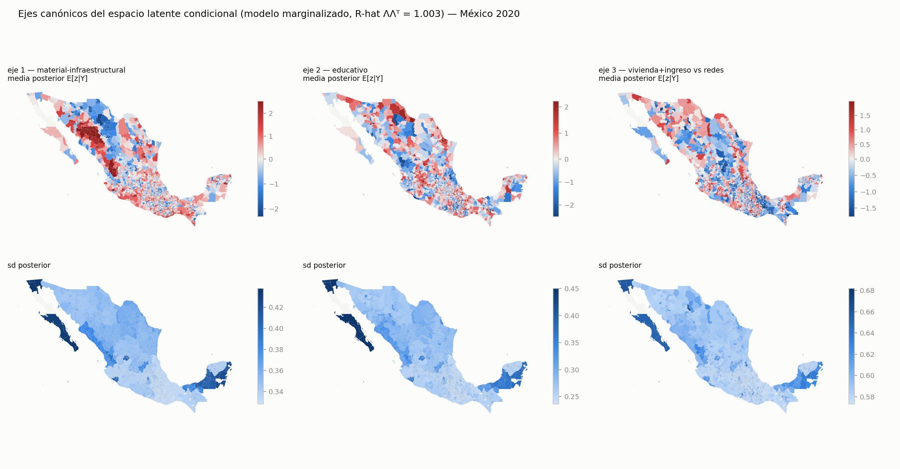
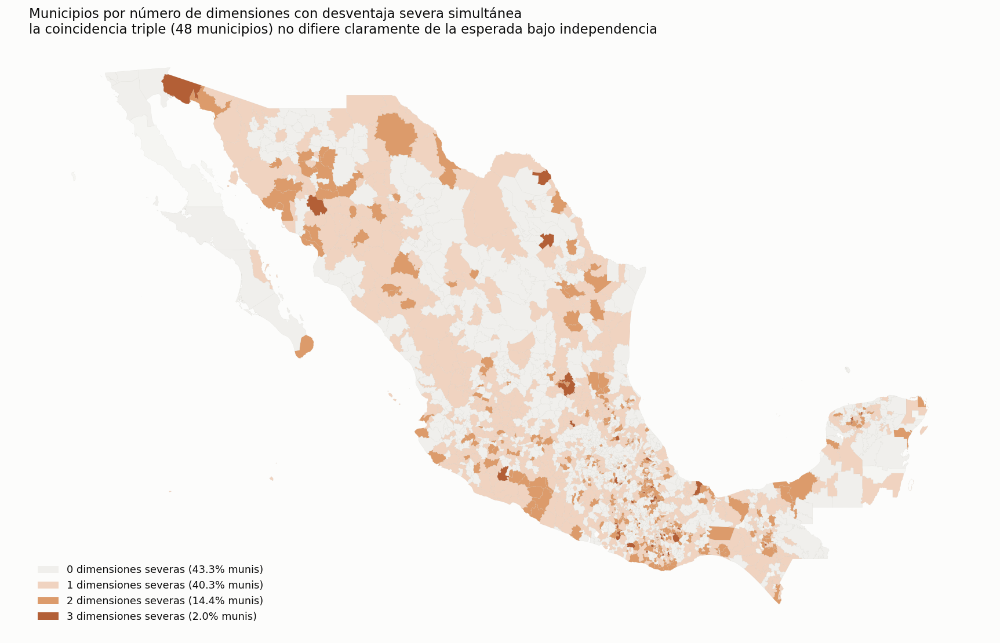
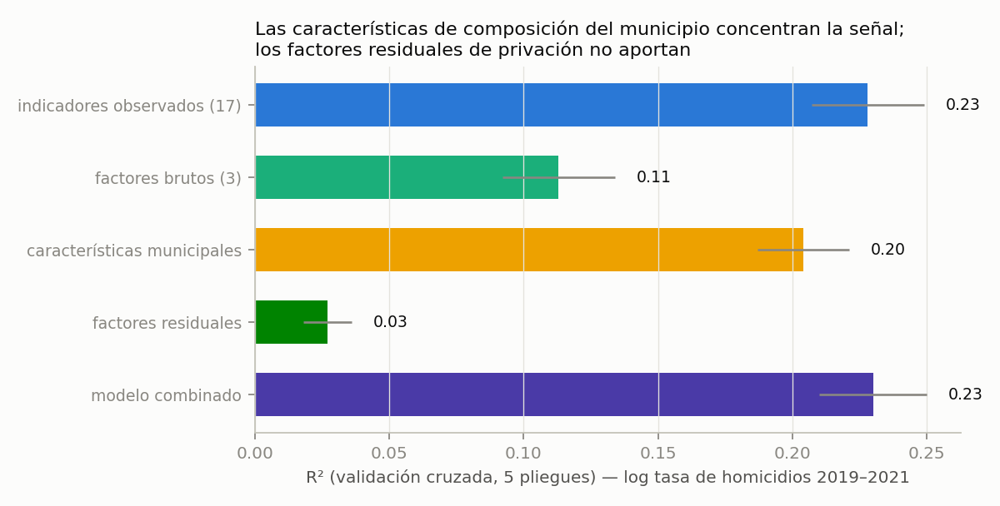
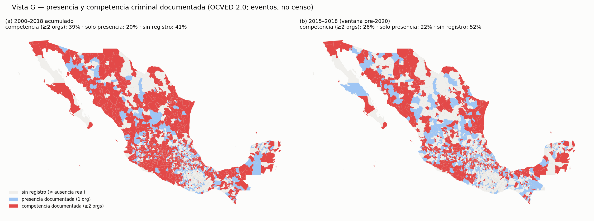

# Desigualdad territorial en dos escalas: geografías disjuntas de la privación municipal en México

**Borrador de trabajo (Paper 2, sustantivo) — 2026-07-12**
*Objetivo editorial: World Development (alternativas alineadas: Regional Studies, Journal of Regional Science, World Development Perspectives; español; traducción al enviar).*
*Versión unificada de referencia: `manuscrito.md`. Paper metodológico compañero: `paper1_metodo.md`.*

## Resumen

¿A qué escala opera la desigualdad territorial mexicana, y se acumulan sus dimensiones en los
mismos lugares? Usando un espacio latente municipal de privación estimado sobre los 17
indicadores elementales de las dos mediciones oficiales (CONAPO y CONEVAL; método en el paper
compañero), documentamos tres resultados. Primero, la desigualdad opera en **dos escalas**:
cerca de la mitad de la dispersión de los indicadores observados ocurre entre estados (Theil
entre-estados 48–59%), mientras la desigualdad residual — descontadas composición y
pertenencia estatal — es predominantemente intraestatal (76–87%). Segundo, las **geografías
residuales rara vez se superponen** (Jaccard 0.05–0.21 entre pares de dimensiones; la triple
severidad apenas excede la esperada bajo independencia): la acumulación multidimensional vive
en el nivel bruto, y el pequeño grupo de municipios severos en las tres dimensiones residuales
tiene un perfil distintivo — pequeño, rural, concentrado en Oaxaca, fuera de la economía de
remesas e invisible a la tipología espacial estándar. Tercero, existe una **brecha de
apropiación territorial**: municipios cuya actividad económica es visible desde satélite pero
cuya mejora social local es menor a la esperada; su predictor dominante es la precariedad
laboral (β = +0.23, t = 8.6), con las remesas operando en sentido inverso. Una escalera
predictiva de circunstancias (geografía heredada → demografía → inserción productiva →
composición indígena) alcanza R² = 0.78 sobre la privación bruta con validación espacialmente
bloqueada. Cinco análisis externos independientes — homicidios, luces nocturnas, exposición
criminal documentada (incluida la coerción política histórica), transición INSABI e incidencia
fiscal — delimitan distintas implicaciones y límites del espacio estimado; donde se
superponen, apuntan a que violencia y privación son dimensiones territorialmente distintas, y
a que las transferencias aún pagan a la vara vieja.

**Palabras clave:** desigualdad territorial; pobreza multidimensional; acumulación de
desventajas; remesas; luces nocturnas; México.

---

## 1. Introducción: más allá de "cuál índice"

El debate aplicado sobre la medición municipal de la pobreza en México suele plantearse como
una elección entre índices. Este paper toma otra ruta: dado un espacio latente de privación
que integra los indicadores elementales de ambas agencias oficiales — con efectos de método y
de estado explícitos, estimado con la maquinaria descrita en el paper compañero
(`paper1_metodo.md`) — pregunta por la **estructura** de la desigualdad territorial: a qué
escala opera, si sus dimensiones se acumulan en los mismos municipios, y si la actividad
económica visible implica inclusión social local. Las tres respuestas (dos escalas; geografías
disjuntas; brecha de apropiación) tienen implicaciones directas de focalización que ningún
índice sintético único puede satisfacer simultáneamente.

El artículo procede así: §2 sitúa la contribución; §3 resume datos y espacio latente (Figura
1) y define los objetos distributivos; §4 presenta la partición en dos escalas (Tabla 1); §5
las geografías disjuntas y su acumulación (Tabla 2, Figura 2); §6 la brecha de apropiación
(Figura 3); §7 la capa de circunstancias (Tabla 3); §8 los cinco análisis externos (Figuras
4–6); §9 discute implicaciones de política. El apéndice documenta las baterías de robustez.

## 2. Antecedentes y trabajo relacionado

Tres literaturas convergen aquí. Primera, la descomposición de la desigualdad: usamos el
índice de Theil (1979) porque es el miembro canónico de la familia aditivamente descomponible
que Shorrocks (1984) axiomatizó — la partición exacta entre/dentro de estados que la tesis de
dos escalas necesita, y que un Gini no ofrece sin residuo. La pregunta de a qué escala vive la
desigualdad territorial — ¿entre regiones o dentro de ellas? — tiene tradición larga en
economía regional; nuestra contribución es hacerla *condicional*: separar la partición del
nivel bruto (lo que las agencias publican) de la partición del residuo (lo que queda tras
composición y pertenencia estatal), y mostrar que son objetos distributivos distintos con
respuestas distintas.

Segunda, la acumulación de desventajas: la literatura de pobreza multidimensional (Alkire &
Foster 2011, la base de la medición mexicana) presupone que las carencias se cuentan porque se
acumulan. Medimos directamente cuánto se acumulan las severidades — en el nivel bruto y en el
residual — con razones observado/esperado bajo independencia e índices de Jaccard, y
encontramos que la acumulación es un fenómeno del nivel, no del residuo.

Tercera, los sensores remotos como lente de desarrollo: las luces nocturnas como proxy de
actividad económica (Henderson, Storeygard & Weil 2012; con la advertencia de ruido de Chen &
Nordhaus 2011) y el salto predictivo con imágenes de Jean et al. (2016), que citamos como
referente sin benchmark propio de imágenes. Nuestro uso es inverso al habitual: no predecimos
pobreza con luces para sustituir encuestas, sino que usamos la *discordancia* entre lo que la
luz predice y lo que la medición social observa como objeto de estudio — la brecha de
apropiación.

## 3. Datos y espacio latente (resumen)

Diecisiete indicadores elementales (9 CONAPO, 8 CONEVAL) para 2,469 municipios en 2020 (2,455
en la matriz del modelo), modelados en escala logit estandarizada dentro de un GLLVM
marginalizado con K=3 factores, efectos de método como contrastes inter-agencia, covariables
de composición y efectos estado×indicador; convergencia verificada sobre el subespacio de
covarianza (R̂ ΛΛᵀ = 1.003). Los ejes canónicos: 1 material-infraestructural, 2 educativo, 3
vivienda+ingreso contra servicios de red. Cada municipio tiene media y desviación posterior
por eje; toda inferencia de este paper hereda esa incertidumbre — los modelos municipales van
ponderados por 1/sd², y la clasificación individual solo es sustantiva en 42/55/14% de los
municipios según el eje (`certeza_canonica.csv`). El detalle metodológico — incluida la
advertencia de que las comparaciones de ingreso intra-estado arrastran la firma del método
SAE — está en el paper 1.

Dos objetos distributivos, definidos con precisión porque §4 los contrasta: el **nivel bruto**
(los indicadores publicados, o el factor material estimado sin covariables ni efectos
estatales) y el **residuo condicional** (los ejes canónicos del modelo completo, que
descuentan composición y pertenencia estatal). Ambos son legítimos; responden preguntas
distintas — "¿dónde está la privación?" versus "¿dónde hay más privación de la que la
estructura del municipio explica?".

## 4. La desigualdad opera en dos escalas

En los indicadores observados, cerca de la mitad de la dispersión ponderada por población
ocurre entre estados (descomposición aditiva entre/dentro del índice de Theil — Theil 1979;
Shorrocks 1984 —: 48–59% entre estados según indicador; 50.8% para el factor material bruto),
con las líneas de ingreso como lo más federalizado (58.8%) — consistente a la vez con la
calibración estatal del método de imputación y con el federalismo fiscal. Una vez descontadas
composición y pertenencia estatal, la desigualdad de los ejes canónicos es predominantemente
intraestatal (76–87%; Tabla 1). No hay contradicción: los efectos estatales absorben la parte
interestatal antes de estimar el residuo — son dos objetos distributivos distintos y los
reportamos como tales.

**Tabla 1. La partición entre/dentro de estados, por objeto distributivo** (fuente:
`desigualdad_theil.csv`; ponderación poblacional; indicadores por Theil, ejes por
descomposición de varianza).

| Objeto | % entre estados | % dentro |
|---|---|---|
| analfabetismo (observado) | 53.1 | 46.9 |
| piso de tierra (observado) | 54.7 | 45.3 |
| línea de pobreza por ingreso (observado) | 58.8 | 41.2 |
| sin agua entubada (observado) | 40.4 | 59.6 |
| factor material bruto | 50.8 | 49.2 |
| eje 1 condicional (material) | 23.6 | 76.4 |
| eje 2 condicional (educativo) | 13.8 | 86.2 |
| eje 3 condicional (viv+ing vs redes) | 13.1 | 86.9 |

La partición bruta es robusta al esquema de ponderación; la residual depende del objeto
distributivo: el componente interestatal del eje 1 casi desaparece al equiponderar municipios
(23.6% → 0.5%), es decir, es un fenómeno de personas concentradas en municipios grandes, no de
territorios (`desigualdad_robustez.csv`, bloque A).

## 5. Las geografías residuales rara vez se superponen

Definiendo severidad como el cuartil superior de cada eje canónico, la proporción de
municipios severos en las tres dimensiones (2.0%) apenas excede la esperada bajo independencia
(1.6%; Tabla 2): la acumulación multidimensional — el municipio "peor en todo" — es un
fenómeno del nivel bruto, donde domina el factor general; el espacio residual selecciona
territorios distintos por dimensión (Figura 2).

**Tabla 2. Acumulación residual: razón observado/esperado de triple severidad y solapamiento
por pares** (fuente: `desigualdad_robustez.csv`, bloque C; IC bootstrap de 1,000 réplicas).

| Umbral de severidad | obs/esp 3 severas | IC95 | Jaccard (1,2) | Jaccard (1,3) | Jaccard (2,3) |
|---|---|---|---|---|---|
| q70 | 1.25 | [1.00, 1.51] | 0.19 | 0.21 | 0.18 |
| q75 | 1.25 | [0.94, 1.62] | 0.15 | 0.18 | 0.14 |
| q80 | 1.43 | [0.97, 1.99] | 0.13 | 0.15 | 0.10 |
| q90 | 2.44 | [0.80, 4.48] | 0.06 | 0.10 | 0.05 |

**Los 48 municipios severos en las tres dimensiones residuales** (fuente: `veta_48_triple.csv`)
tienen un perfil nítido — 24 de 48 en Oaxaca, pequeños (mediana 5,430 habitantes contra
~13,550 nacional), 79% rurales (≥50% de su población en localidades pequeñas; 75% con umbral
≥80%), fuera de la economía de remesas (mediana 17 vs 92 USD per cápita), con *menos*
presencia criminal documentada que el promedio (27% vs 48%) y casi todos invisibles para la
tipología espacial de discordancia (44/48 no significativos en LISA). No son los municipios
prominentes de la pobreza mexicana ni los de la violencia, y ninguna de las lentes usuales —
índice agregado, mapa de clusters, registro de eventos — los selecciona. Dos cautelas: el
grupo es pequeño y sensible al umbral (la razón observado/esperado roza 1), y el eje 3 tiene
la certeza municipal más baja del sistema — se reporta como caracterización descriptiva, no
como estrato estadísticamente robusto.

## 6. La brecha de apropiación territorial

**Construcción.** La brecha se define en tres pasos, todos fuera de muestra: (i) se predice la
privación material bruta de cada municipio a partir de sus luces nocturnas — el proxy de
actividad de Henderson, Storeygard & Weil 2012 y Chen & Nordhaus 2011 — y su geografía física
(gradient boosting, validación cruzada agrupada por estado: la predicción de cada municipio
proviene de un modelo que no vio ningún municipio de su estado); (ii) la brecha es el residual
z_observado − z_predicho de esa predicción out-of-fold (`satelital_oof.parquet`, modelo de
lentes M3); (iii) la brecha se regresa sobre candidatos a explicación con efectos fijos
estatales y errores robustos HC1. Brecha positiva = el municipio está *peor* socialmente de lo
que su actividad visible sugiere.

**Resultado.** El predictor dominante es la precariedad laboral (β = +0.23, t = 8.6) —
municipios donde la actividad existe y brilla pero la inserción es por cuenta propia, jornal o
sin pago — seguido del tamaño urbano (+0.15; pobreza urbana invisible a la luz agregada); las
remesas operan en sentido contrario (−0.07, t = −5.3): mejoran vivienda e ingreso sin huella
productiva local equivalente (β de signo opuesto por factor: −0.034 material, +0.027
monetario). El contraste descriptivo entre colas es elocuente: la mediana de remesas en los
municipios "mejor de lo esperado por sus luces" es ~20 veces (IC95 14–28) la de los
subestimados (Figura 3). **La actividad territorial no implica inclusión laboral local.**

## 7. Circunstancias y oportunidades

¿Cuánta de la privación bruta es predecible desde circunstancias estructurales que ningún
municipio elige? Una escalera incremental (gradient boosting, validación cruzada bloqueada por
estado — GroupKFold de 5 pliegues sobre los 32 estados —; Tabla 3) responde: geografía heredada
0.27; + composición demográfica 0.47; + inserción productiva 0.73; + composición indígena
(ITER 2020: % hablantes de lengua indígena y % monolingüe, columnas verificadas en el
diccionario oficial; `vistaD_indigena.parquet`) **0.78**. La contribución condicional indígena
es moderada (Δ +0.04) no porque la dimensión étnica no importe, sino porque su huella ya viaja
dentro de la geografía, la demografía y la inserción — la desventaja indígena en México está
estructuralmente *incorporada* en las circunstancias territoriales. Formulación disciplinada:
predecible-desde, no causado-por.

**Tabla 3. Escalera predictiva de circunstancias → privación material bruta** (fuente:
`desigualdad_robustez.csv`, bloque capa3; R² de validación cruzada bloqueada por estado).

| Bloque de circunstancias | R²cv | Δ |
|---|---|---|
| geografía heredada (rugosidad, elevación, aislamiento, dispersión) | 0.265 | +0.265 |
| + composición demográfica | 0.469 | +0.204 |
| + inserción productiva (sectores, precariedad) | 0.732 | +0.263 |
| + composición indígena | **0.775** | +0.042 |
| + pertenencia estatal (KFold simple — NO bloqueado, no comparable) | 0.891 | — |

## 8. Cinco análisis externos

Cinco análisis externos independientes, ninguno usado en la construcción del espacio latente,
delimitan distintas implicaciones y límites del espacio estimado:

1. **Homicidios** (100 mil registros oficiales; orden estable en siete variantes de
   sensibilidad; `sensibilidad_homicidios.csv`, Figura 4): la privación explica ~23% de la
   violencia municipal, casi todo vía composición; el residual no aporta. La señal es un
   contraste intra-familia casi ortogonal al nivel — un índice sintético único no puede
   focalizar privación y anticipar violencia a la vez.
2. **Luces nocturnas** (`reporte_satelital.md`): ven la privación material bruta (R² 0.41–0.43
   con bloqueo espacial no administrativo; sin transferencia entre macroregiones) y nada del
   residual (24/24 R² < 0). La relación log-lineal canónica de esta literatura (y el salto
   predictivo de Jean et al. 2016, aquí solo como referente, sin benchmark propio de imágenes)
   se resuelve a escala municipal en regímenes: piso oscuro (14% de municipios), umbrales
   regionales con IC disjuntos, sin saturación urbana.
3. **Exposición criminal documentada** (OCVED, 65 mil eventos diario-municipales con actores;
   `reporte_crimen_desigualdad.md`, Figura 5): predice violencia — más bajo competencia entre
   organizaciones que bajo monopolio (+0.130 vs +0.083) — y es esencialmente ortogonal a la
   privación residual (resultado negativo documentado con robustez). La **coerción política
   histórica** (ataques a autoridades y candidatos 2007–2012; Trejo & Ley 2021, datos de
   réplica doi:10.7910/DVN/VIXNNE; `g5_coercion.csv`) refuerza el patrón como exposición
   rezagada: no se identifica una ruta robusta hacia la privación residual de 2020 (el
   indicador de coerción es nulo en los ejes 1 y 2, y en el eje 3 el indicador y la tasa se
   contradicen — colinealidad entre ambas medidas, no una ruta), mientras que sí predice
   homicidio 2019–21 una década después (+0.26, t = 2.7) y ocurrió donde competencia criminal
   y fragmentación política interactúan. Advertencia permanente: los datos de eventos observan
   O = R × D — presencia documentada no es control territorial y la ausencia de registro no es
   ausencia real; todos los modelos llevan proxies de observabilidad.
4. **Transición INSABI**: la varianza estatal máxima del sistema corresponde a la carencia de
   salud, con correlación +0.61 con la dependencia estatal del Seguro Popular/INSABI (máxima
   de los 17 indicadores; placebos 0.18–0.49) — el componente estatal captura política real,
   no solo ruido de medición.
5. **Incidencia fiscal** (Figura 6): a igual privación y tamaño, los municipios "más
   marginados que pobres" reciben +15.8% de transferencias del Ramo 33 per cápita (t = 4.3) —
   el piso heredado de la fórmula antigua de masa carencial sigue pagando al perfil de
   marginación. **La vara con que se mide un municipio vale dinero.**

Las cinco piezas no validan la misma cantidad, y conviene decirlo: homicidios prueba la
ortogonalidad del residuo con la violencia; el satélite, la visibilidad de lo material bruto;
INSABI interpreta un efecto estatal puntual; la exposición criminal aporta un resultado
negativo robusto sobre privación; y la fiscalidad muestra consecuencias distributivas de la
medición. Juntas delimitan qué es — y qué no es — el espacio estimado. En lo único en que sí
se superponen (violencia y privación residual como dimensiones territorialmente distintas)
llegan por caminos independientes, y ahí la convergencia importa más que cada pieza.

## 9. Implicaciones de política

1. **Focalización**: focalizar a los más pobres en todo (nivel bruto) y focalizar los peores
   residuos por dimensión produce listas casi disjuntas. La elección entre ambas es una
   decisión distributiva que hoy se toma implícitamente al elegir índice; conviene tomarla
   explícitamente. Los 48 triple-severos residuales — invisibles a todas las lentes usuales:
   los olvidados de los olvidados — son el caso de prueba concreto.
2. **La vara que paga**: mientras la fórmula de transferencias conserve pisos heredados de la
   masa carencial, el perfil de marginación seguirá cobrando prima sobre la pobreza vigente a
   igual privación. El diseño de fórmulas debería auditarse contra la circularidad
   medición→dinero→fenómeno (agenda del paper 3, con montos anuales).
3. **Ninguna lente única**: índice, satélite y registro de eventos ven dimensiones distintas y
   fallan en lugares distintos (la luz no ve pobreza urbana; los eventos no ven donde no hay
   prensa; el índice no ve el residuo). La política que use una sola lente hereda sus puntos
   ciegos — documentados aquí con su geografía.

## Apéndice: baterías de robustez

**A. Ponderación de la partición** (`desigualdad_robustez.csv`, bloque A): el % entre estados
del nivel bruto es estable a población / municipio equiponderado / exclusión de municipios
<1,000 habitantes (50.8 / 47.6 / 50.7 para el factor material); el del eje 1 condicional cae
de 23.6 a 0.5 al equiponderar — la sensibilidad es del objeto distributivo, y se declara.

**B. Umbrales de acumulación** (Tabla 2): la razón observado/esperado y los Jaccard se
reportan en q70/q75/q80/q90 con bootstrap; ninguna configuración lleva la triple severidad
lejos de la independencia.

**C. Homicidios, siete variantes** (`sensibilidad_homicidios.csv`): ventana temporal,
ocurrencia vs residencia, suavizamiento EB, transformación, exclusión de metrópolis, pesos y
pliegues — el orden de los conjuntos predictores (composición > bruto > residuo ≈ 0) es
estable en las siete; la diferencia composición−residuo es positiva en todos los pliegues de
todas las variantes (+0.06 a +0.21).

**D. Crimen: escenarios de cobertura** (`g_robustez.csv`, `g5_coercion.csv`): los negativos de
privación sobreviven sin proxies de observabilidad, sin las 5 metrópolis y en las tres
ventanas (2015–18, Calderón 2006–11, 2018); el contraste competencia>monopolio sobre homicidio
sobrevive las ventanas y se atenúa sin la descomposición por número de organizaciones; la
coerción histórica mantiene su asociación con homicidio (t 2.4–2.7) en todos los escenarios.

**E. Brecha: definición del residual**: la regresión de la brecha es estable a estimar sobre
el factor bruto rung-1 o los 6 indicadores observados directamente; el signo opuesto de
remesas por factor (−0.034 material / +0.027 monetario) replica con ambos outcomes
(`reporte_satelital.md`).

## Referencias

- Alkire, S. & Foster, J. (2011). Counting and multidimensional poverty measurement. *Journal
  of Public Economics*. doi:10.1016/j.jpubeco.2010.11.006
- Chen, X. & Nordhaus, W.D. (2011). Using luminosity data as a proxy for economic statistics.
  *PNAS*. doi:10.1073/pnas.1017031108
- Henderson, J.V., Storeygard, A. & Weil, D.N. (2012). Measuring Economic Growth from Outer
  Space. *American Economic Review*. doi:10.1257/aer.102.2.994
- Jean, N., Burke, M., Xie, M., Davis, W.M., Lobell, D.B. & Ermon, S. (2016). Combining
  satellite imagery and machine learning to predict poverty. *Science*.
  doi:10.1126/science.aaf7894
- Shorrocks, A.F. (1984). Inequality Decomposition by Population Subgroups. *Econometrica*.
  doi:10.2307/1913511
- Theil, H. (1979). World income inequality and its components. *Economics Letters*.
  doi:10.1016/0165-1765(79)90213-1
- Trejo, G. & Ley, S. (2021). High-Profile Criminal Violence: Why Drug Cartels Murder
  Government Officials and Party Candidates in Mexico. *British Journal of Political Science*
  51(1): 203–229. doi:10.1017/S0007123418000637. Datos de réplica: Harvard Dataverse,
  doi:10.7910/DVN/VIXNNE.

(La literatura sustantiva mexicana — Cortés, Boltvinik, Lustig, Székely, CEEY, CONEVAL,
CONAPO — se integrará desde `reporte_literatura.md` en la versión de envío.)

---

*Materiales: todos los resultados, figuras y tablas son reproducibles desde el repositorio
(scripts numerados por capítulo, manifiesto de figuras y manifiesto de datos crudos con URLs y
advertencias de cada fuente; sincronía prosa-dato verificada por `check_dag_conteos.py` y
`check_captions.py`). Cifras citadas y sus outputs: Theil y robustez (`desigualdad_theil.csv`,
`desigualdad_robustez.csv`), acumulación (`fig_acumulacion.png`), triple-severos
(`veta_48_triple.csv`), brecha (`satelital_oof.parquet`, `reporte_satelital.md`), crimen y
coerción (`reporte_crimen_desigualdad.md`, `g5_coercion.csv`), fiscal
(`gap_aportaciones_regimen.csv`, `reporte_dgp_dag.md` §4b).*
