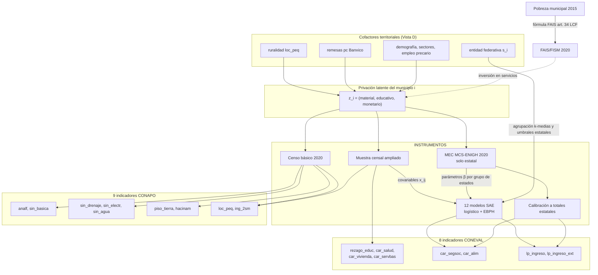

# El proceso generador de datos: DAG estructural de marginación y pobreza municipal 2020

**Propósito.** Hacer explícito el proceso generador de datos (DGP) detrás de los 17 indicadores
elementales, como grafo acíclico dirigido. No es un DAG causal en sentido fuerte (Pearl): es un
**DAG de medición** — qué instrumento produce qué número, con qué insumos, y por dónde se filtran
dependencias mecánicas que el modelo puede confundir con estructura sustantiva. Cada arista está
documentada en las notas técnicas oficiales (CONAPO dic. 2021; CONEVAL dic. 2021).

---

## 1. Pipeline CONAPO — Índice de Marginación 2020

**Fuente:** una sola — Censo de Población y Vivienda 2020 (INEGI).

| Insumo | Indicadores |
|---|---|
| Cuestionario básico (tabulados) | `analf`, `sin_basica`, `sin_drenaje`, `sin_electr`, `sin_agua`, `piso_tierra`, `loc_peq` |
| Laboratorio de Microdatos INEGI | `hacinam` (nuevo criterio 2020: >2.5 ocupantes por dormitorio) |
| Cuestionario ampliado (microdatos, muestra) | `ing_2sm` |

Detalles del cálculo que importan para el modelo:

- **Denominadores excluyen "no especificado"** en cada indicador; los no especificados de
  educación se redistribuyen proporcionalmente antes de calcular `sin_basica`.
- **Universos distintos por indicador**: población 15+ (educación), ocupantes de viviendas
  (servicios), viviendas (hacinamiento), población total (`loc_peq`), población ocupada (`ing_2sm`).
  El "municipio" no es una sola población: es cuatro.
- `ing_2sm` es el único indicador CONAPO que viene de la **muestra** (ampliado), no del censo
  completo → tiene error muestral que los otros 8 no tienen; comparte instrumento con las
  covariables censales de los modelos SAE de CONEVAL.
- **Agregación DP2 (Pena Trapero)**: `DP2 = Σ_j (d_ij/σ_j)(1 − R²_{j·j−1,…,1})`, con base de
  referencia = peor escenario 2010–2020 y orden de entrada de variables por contenido
  informativo (coeficiente de discriminación de Ivanovic; el algoritmo canónico itera el orden
  hasta convergencia vía correlación con el índice previo). Después: estratificación
  Dalenius–Hodges (21 clases a nivel municipal) → 5 grados.
- **Implicación**: el índice final es una función determinista, *casi lineal por tramos*, de los
  9 componentes. Todo lo que el índice sabe está en los componentes → trabajar con los
  componentes (como hace este repo) no pierde información y evita heredar los pesos `(1−R²)`,
  que son un artefacto del orden de entrada.

## 2. Pipeline CONEVAL — Pobreza municipal 2020

**Dos fuentes que no se tocan al mismo nivel:**

1. **MEC del MCS-ENIGH 2020** — representativa nacional y estatal. Mide TODO (ingreso, 6
   carencias) pero no baja a municipio.
2. **Muestra del Censo 2020 (cuestionario ampliado)** — representativa municipal. Mide 4
   carencias directamente; NO mide ingreso, alimentación ni seguridad social completa.

| Indicador | Cómo se obtiene a nivel municipal |
|---|---|
| `rezago_educ`, `car_salud`, `car_vivienda`, `car_servbas` | **Directo** de la muestra censal (estimación de diseño) |
| `car_segsoc` | **12 modelos logísticos** (6 grupos de estados por k-medias sobre incidencia de pobreza × urbano/rural), ajustados en MEC-ENIGH, predichos sobre la muestra censal. Umbral de dicotomización = media estatal de carencia en MEC-ENIGH. Con "rescate de información" (asigna no-carencia a quien declara acceso directo en censo). Criterios de aceptación: ≥90% casos bien clasificados; diferencia ≤1% nacional, ≤3% estatal |
| `car_alim` | Igual (12 logísticos, stepwise dos vías p<0.1), sin rescate; tolerancias 3%/5% |
| `lp_ingreso`, `lp_ingreso_ext` | **EBPH**: modelo lineal mixto `Y_ij = x'_ij β + γ_i + ε_ij` sobre log-ingreso (γ_i = efecto aleatorio municipal), con heterocedasticidad estilo ELL (un "modelo alfa" para la varianza por hogar), estimado en MEC-ENIGH por los mismos 12 grupos, **100 simulaciones** del ingreso por hogar censal → proporción bajo LPI/LPEI |
| Integración | Cuadrantes pobreza = f(carencias, ingreso) promediados sobre las 100 simulaciones |
| **Calibración** | Ponderadores recalibrados (logit, Deville–Särndal) para que los agregados municipales **cuadren exactamente con los estatales del MEC-ENIGH**; solo en municipios >10 mil hab. no censados |

## 3. El DAG

*(Los índices finales — IM/DP2 de CONAPO, cuadrantes de CONEVAL, IRS — son funciones
deterministas de los nodos indicadores; se omiten porque el repo trabaja con componentes.)*

## 4. Las cinco dependencias mecánicas que el DAG hace visibles

**(1) Bloques de método por instrumento compartido.** Los pares casi-duplicados
(`sin_drenaje`/`sin_electr`/`sin_agua` vs `car_servbas`; `piso_tierra`/`hacinam` vs
`car_vivienda`; `analf`/`sin_basica` vs `rezago_educ`) no son mediciones independientes del
mismo constructo: salen de las **mismas preguntas censales**, agregadas con universos y
umbrales distintos. Su correlación residual es de instrumento, no de fenómeno →
justifica los bloques `m_ij` del GLLVM exactamente como están (educación / líneas de ingreso /
vivienda-servicios).

**(2) Correlación inducida por los modelos SAE.** `car_segsoc`, `car_alim`, `lp_ingreso*` a
nivel municipal son *predicciones* construidas con covariables de la muestra censal — el mismo
instrumento que genera los indicadores CONAPO. Si el logístico de alimentación usa educación y
vivienda del censo como predictores, parte de la correlación observada entre `car_alim` y
`sin_basica` es **mecánica** (comparten x), no evidencia de un factor común. El GLLVM no puede
distinguirla de estructura real; lo honesto es reconocer que las cargas de los indicadores SAE
sobre el factor material están *infladas por construcción*. Dirección del sesgo: hacia
sobre-estimar la comunalidad de los indicadores modelados. (Verificable: contrastar la
comunalidad de `car_alim` — modelado — contra `car_salud` — directo; la ortogonalidad casi
total de `car_salud`, comunalidad 0.02 en el reporte de dimensionalidad, es consistente con que
lo directo trae señal propia y lo modelado trae señal prestada.)

**(3) Suavizamiento y umbral estatal.** Los 12 modelos se ajustan por *grupos de estados* y el
umbral de dicotomización es la **media estatal**; la calibración fuerza los agregados estatales.
Consecuencia: la varianza intra-estatal de los indicadores SAE está atenuada y su nivel estatal
está anclado a la ENIGH. Los **efectos estatales del peldaño 3 tienen entonces doble lectura**:
geografía sustantiva *y* artefacto de calibración — para los indicadores SAE, γ_s absorbe el
benchmarking. Predicción comprobable: γ_s debería ser mayor (en magnitud) para
`car_segsoc`/`car_alim`/`lp_ingreso*` que para los indicadores censales directos.

**(4) `ing_2sm` es el puente.** Es CONAPO pero viene del cuestionario ampliado (la misma
muestra censal que alimenta los SAE de CONEVAL) y mide ingreso laboral — conceptualmente cercano
a `lp_ingreso`. Comparte instrumento con un lado y constructo con el otro. Cualquier "factor
monetario" que los junte hereda ambas cosas; el bloque de método de líneas de ingreso no lo
incluye (correcto: no comparte el paso SAE), pero su carga en el factor monetario debe leerse
con esta ambigüedad.

**(5) Circularidad de política: FAIS.** El Fondo de Aportaciones para la Infraestructura Social
se distribuye por la fórmula del art. 34 de la Ley de Coordinación Fiscal usando **la medición
municipal de pobreza extrema de CONEVAL** (2015 para ejercicios ~2020). El gasto FAIS financia
justo agua/drenaje/piso/electricidad — los indicadores del lado izquierdo del DAG. Usar FAIS (o
totales municipales de aportaciones, que lo contienen) como *covariable* condicionaría sobre un
descendiente del outcome medido: sesgo de colisionador/mediador garantizado. FAIS entra al
análisis solo como **variable de validación o de política**, jamás como cofactor del espacio
latente.

## 5. Implicaciones directas para la escalera GLLVM

| Decisión de especificación | Arista del DAG que la justifica |
|---|---|
| Verosimilitud gaussiana en logit, no binomial | Los SAE no son conteos: son predicciones con error de modelo; una binomial les daría precisión falsa (n_efectivo ≫ información real) |
| Bloques de método `m_ij` | Dependencia (1): instrumento compartido |
| Uniqueness libre por indicador (`s_ij`), esp. `car_salud` | Indicadores directos traen señal propia no compartida |
| Efectos estatales (peldaño 3) con lectura de medición | Dependencia (3): calibración estatal de los SAE |
| No apilar estado + BYM2 | Ambos son proxies de la misma geografía; además γ_s ya carga el artefacto de calibración |
| Excluir FAIS/aportaciones como cofactor | Dependencia (5): circularidad de política |
| Cofactores limpios: remesas (Banxico), demografía, sectores | Medidos por instrumentos ajenos a ambos pipelines |

**Dos análisis nuevos que el DAG sugiere** (implementables con lo que ya hay en `outputs/`):

- **A. Contraste directo-vs-modelado**: comparar comunalidades y |γ_s| entre los 4 indicadores
  CONEVAL directos y los 4 modelados. Si (2) y (3) son ciertas, los modelados tendrán mayor
  comunalidad en el factor material y mayor varianza estatal.
- **B. Descomposición de γ_s con covariables estatales medidas** (PIBE pc, gasto estatal/PIB,
  dependencia de transferencias): regresión jerárquica post-hoc sobre los efectos del peldaño 3
  — responde "¿la geografía discreta es capacidad fiscal estatal o es artefacto de calibración?"
  sin refit del GLLVM.

## Fuentes

- CONAPO (2021), *Índice de marginación por entidad federativa y municipio 2020. Nota
  técnico-metodológica* — [PDF](https://www.gob.mx/cms/uploads/attachment/file/685354/Nota_te_cnica_IMEyM_2020.pdf)
- CONEVAL (2021), *Metodología para la medición de la pobreza en los municipios de México,
  2020* — [PDF](https://www.coneval.org.mx/Medicion/Documents/Pobreza_municipal/2020/Metodologia_pobreza_municipal_2020.pdf);
  réplica: [Programas de cálculo](https://www.coneval.org.mx/Medicion/Paginas/Programas_BD_municipal_2010_2020.aspx)
- Ley de Coordinación Fiscal, art. 34 (fórmula FAIS); CONEVAL, *Análisis de los Fondos de
  Aportaciones del Ramo 33* — [PDF](https://www.coneval.org.mx/coordinacion/Documents/monitoreo/Ramo33/Analisis_Ramo_33_a_traves_de_sus_indicadores.pdf)
- Pena Trapero (1977); Zarzosa (1996, 2009); Somarriba y Pena (2009) — método DP2.
- Rao y Molina (2015); Molina, Nandram y Rao (2014); Elbers, Lanjouw y Lanjouw (2003) — SAE/EBPH/ELL.
- Deville y Särndal (1992, 1993) — calibración.
